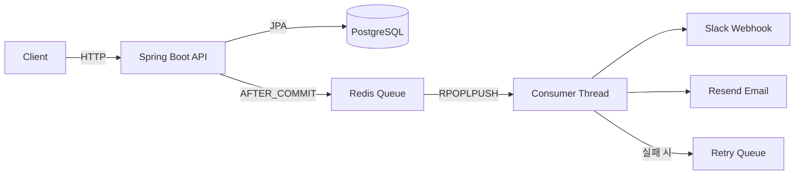

# PMSaaS Backend

> 소규모 팀을 위한 Workspace-Project-Task 계층 구조의 협업 SaaS 백엔드 -
> JWT 인증, Redis 기반 비동기 알림, Slack Webhook 연동 지원


## 기술 스택

| 분류 | 기술 |
|------|------|
| Language | Java 21 |
| Framework | Spring Boot 3.5.7, Spring Security |
| ORM | JPA (Hibernate), QueryDSL |  
| Auth | JWT (Access + Refresh Token) |
| Async | Redis Queue (알림 비동기 처리) |
| Notification | Slack Webhook, Resend Email |
| DB | PostgreSQL |
| Infra | Docker, Docker Compose |
| Build | Gradle |

## 아키텍처


## 사전 요구사항
- [Docker](https://docs.docker.com/get-docker/)
- Git

## 실행 방법
### 1. 저장소 클론
```bash
git clone https://github.com/chepchep2/pmsaas-backend.git
cd pmsaas-backend
```

### 2. 환경변수 설정
```bash
cp .env.example .env
```

### 3. Docker 실행
```bash
docker compose up -d
```

PostgreSQL, Redis, Spring Boot 애플리케이션 컨테이너가 함께 실행됩니다.

### 4. 서버 접속
```text
http://localhost:8080
```

## API 목록

| 도메인 | Method | Endpoint | 설명 |
|--------|--------|----------|------|
| Auth | POST | `/api/auth/register` | 회원가입 |
| Auth | POST | `/api/auth/login` | 로그인 |
| Auth | GET | `/api/auth/me` | 내 정보 조회 |
| Auth | POST | `/api/auth/refresh` | 토큰 갱신 |
| Workspace | GET | `/api/workspaces` | 워크스페이스 목록 |
| Workspace | POST | `/api/workspaces` | 워크스페이스 생성 |
| Workspace | GET | `/api/workspaces/{id}` | 워크스페이스 조회 |
| Workspace | PATCH | `/api/workspaces/{id}` | 워크스페이스 수정 |
| Workspace | DELETE | `/api/workspaces/{id}` | 워크스페이스 삭제 |
| Workspace | GET | `/api/workspaces/{id}/members` | 멤버 목록 |
| Workspace | GET | `/api/workspaces/{id}/members/unified` | 멤버+초대 통합 목록 |
| Workspace | GET | `/api/workspaces/{id}/members/me` | 내 멤버 정보 |
| Workspace | POST | `/api/workspaces/{id}/members` | 멤버 추가 |
| Workspace | DELETE | `/api/workspaces/{id}/members/{memberId}` | 멤버 제거 |
| Workspace | POST | `/api/workspaces/{id}/members/leave` | 워크스페이스 탈퇴 |
| Project | GET | `/api/workspaces/{id}/projects` | 프로젝트 목록 |
| Project | GET | `/api/workspaces/{id}/projects/{projectId}` | 프로젝트 조회 |
| Project | POST | `/api/workspaces/{id}/projects` | 프로젝트 생성 |
| Project | PATCH | `/api/workspaces/{id}/projects/{projectId}` | 프로젝트 수정 |
| Project | DELETE | `/api/workspaces/{id}/projects/{projectId}` | 프로젝트 삭제 |
| Task | GET | `/api/tasks` | 전체 태스크 목록 |
| Task | GET | `/api/workspaces/{id}/tasks` | 워크스페이스 태스크 목록 |
| Task | GET | `/api/workspaces/{id}/projects/{pid}/tasks` | 프로젝트 태스크 목록 |
| Task | POST | `/api/workspaces/{id}/tasks` | 태스크 생성 |
| Task | PUT | `/api/tasks/{id}` | 태스크 수정 |
| Task | DELETE | `/api/tasks/{id}` | 태스크 삭제 |
| Task | PATCH | `/api/tasks/{id}/toggle` | 완료 토글 |
| Task | PATCH | `/api/tasks/{id}/move` | 태스크 이동 |
| Task | PATCH | `/api/tasks/{id}/assignees` | 담당자 수정 |
| Task | PATCH | `/api/tasks/{id}/due-date` | 마감일 수정 |
| Invitation | POST | `/api/workspaces/{id}/invitations` | 초대 발송 |
| Invitation | POST | `/api/workspaces/{id}/invitations/resend` | 초대 재발송 |
| Invitation | POST | `/api/workspaces/{id}/invitations/{code}/accept` | 초대 수락 |
| Notification | GET | `/api/notifications/me` | 내 알림 목록 |
| Notification | GET | `/api/workspaces/{id}/notifications` | 워크스페이스 알림 목록 |

## 핵심 기술 포인트

- **Redis RPOPLPUSH + AFTER_COMMIT 비동기 알림**: 트랜잭션 롤백 시 큐 push 방지, 서버 크래시 시 processing -> queue 자동 복원으로 메세지 유실 없는 안전한 알림 패턴 구현
- **UNION ALL 기반 3단 복합 커서 페이지네이션**: 스키마가 다른 두 테이블(workspace_members + invitations)을 typePriority + sortAt + rowId 커서로 중복/누락 없이 하나의 정렬된 리스트로 조회
- **초대 상태 전이 + 중복 수락 방지**: PENDING -> SENDING -> SENT -> ACCEPTED 순서로만 상태 변경, (workspace_id, user_id) DB 유니크 제약으로 이미 멤버인 경우 기존 멤버 정보 반환으로 중복 가입 방지

## 테스트 실행
```bash
./gradlew test
```
